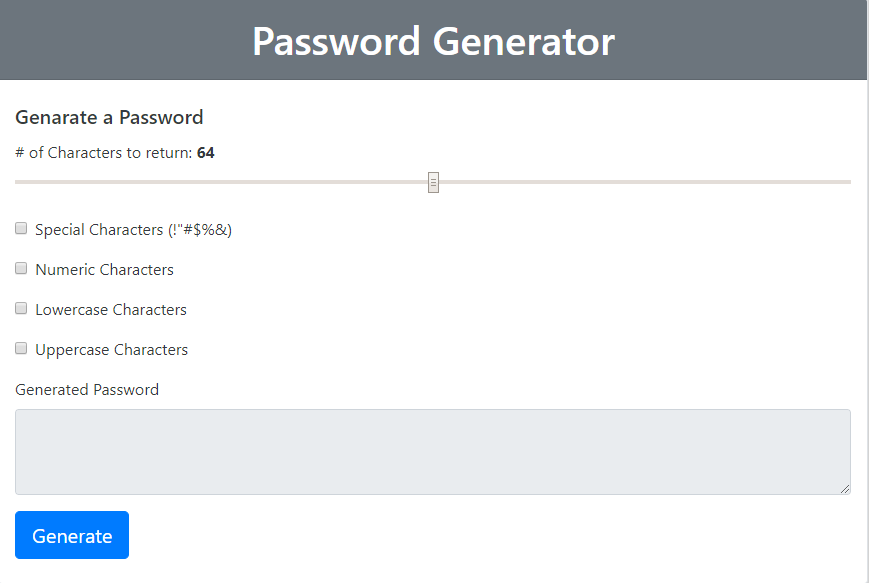

This is a triva game that uses javaScrip and jquery

Start button starts the game--- 100seconds is added to the timer. 

As you answer the questions your are rewared 10 points for every correction answer

if you answer incorrectly 10 seconds is deducted from the timer

When the timer reaches zero your directed to a page where you can enter your initials to be added a highscore list

The next page is said highscore list that is saved to your browser.

