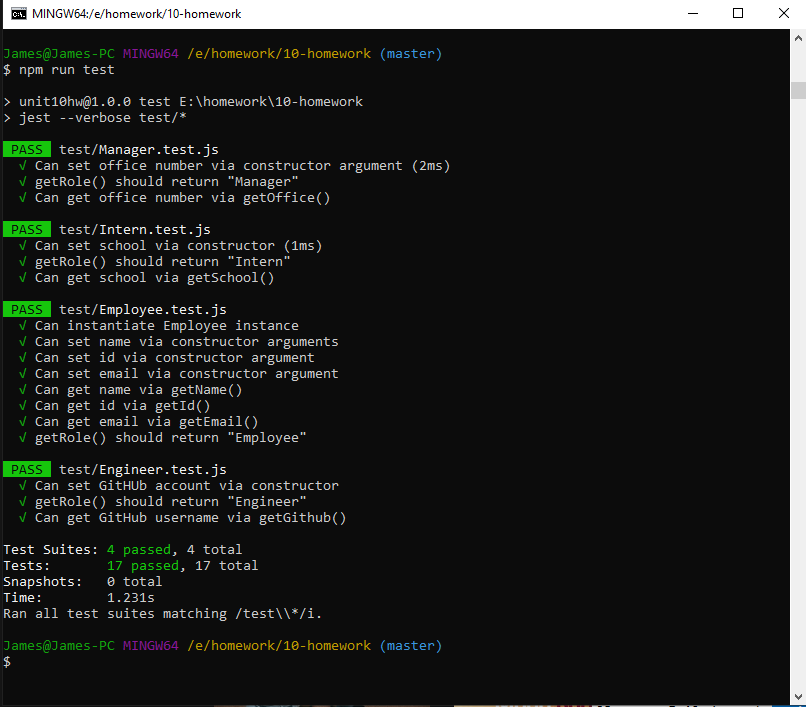

# Version 0.91

```
As a manager
I want to generate a webpage that displays my team's basic info
so that I have quick access to emails and GitHub profiles
```

*From the above prompt I was asked to make a node.js application that would prompt the user for different information on employees and return a webpage to display the team members and their information. The app is not limited in the number of employees that can be added.

The jest tests are all working and functioning properly.



