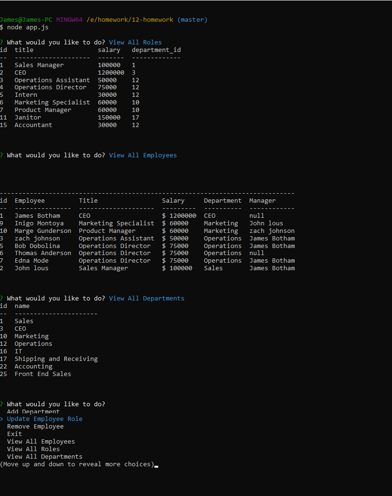

v 1.0 -- 

Tasked with created a node.js application that can be used to track employees, departments, and roles within a company and saves data to mysql server.

<a href="https://youtu.be/ZVQUAecUHAg">Link</a> To Youtube video demonstrating the app's functionality.

